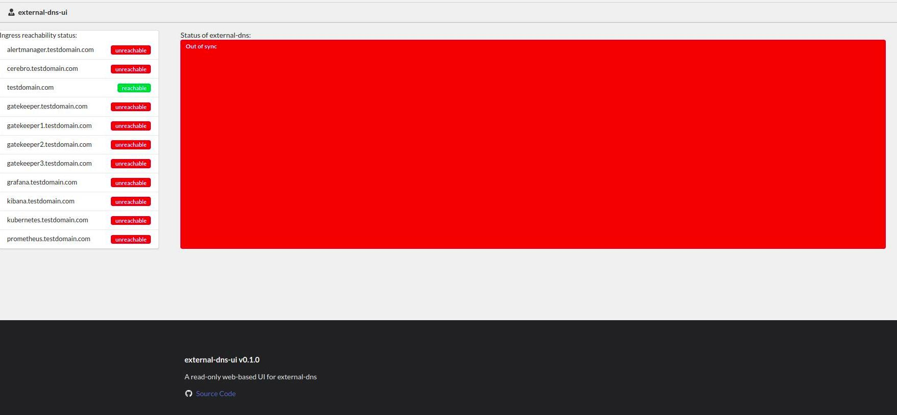

# external-dns-ui

External-dns-ui is a read-only web-based UI for external-dns (https://github.com/kubernetes-sigs/external-dns).

The purpose of the project is to provide a quick overview of the creation status of Ingress DNS records via a correctly configured external-dns.



⚠️⚠️⚠️ This project is in alpha stage, use at your own risk ⚠️⚠️⚠️

:heart: Inspired by and based on Gatekeeper Policy Manager https://github.com/sighupio/gatekeeper-policy-manager :heart:

## Requirements

- Kubernetes cluster
- Correctly configured deployment of `external-dns`

## How to deploy external-dns-ui

Simply apply the Kubernetes manifests generated via `manifests/kustomization.yaml` into your Kubernetes cluster. For example:

```bash
kubectl apply -k manifests
```

⚠️ Please ensure that the namespace specified inside `manifests/kustomization.yaml` is the namespace where your external-dns is running.

Once you've deployed external-dns-ui, if you haven't set up an ingress, you can access the web-UI using port-forward:

```bash
kubectl -n external-dns port-forward svc/external-dns-ui 8000:80
```

## Configuration

You can configure external-dns-ui via the following environment variables:

| Env Var Name                       | Description                                                                                                       | Default                |
| ---------------------------------- | ----------------------------------------------------------------------------------------------------------------- | ---------------------- |
| `EDUI_NAMESPACE`                   | The name of the namespace where your external-dns deployment is running                                           | `external-dns`         |
| `EDUI_PREFERRED_URL_SCHEME`        | URL scheme to be used while generating links.                                                                     | `http`                 |
| `EDUI_LOG_LEVEL`                   | Log level (see [python logging docs](https://docs.python.org/2/library/logging.html#levels) for available levels) | `INFO`                 |

## Development

External-dns-ui is written in Python using the Flask framework for the backend and Fromantic-UI for the frontend.

Script `test/setup_test_environment.sh` builds & pushes the image, and runs the app in a Minikube test environment.
